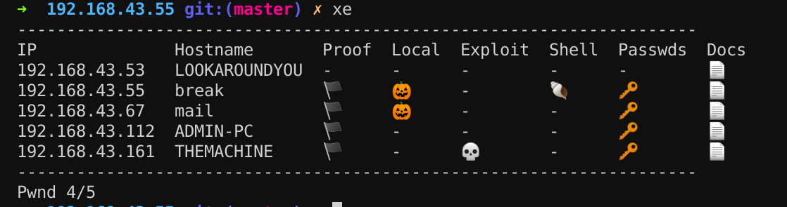

```

  ▄       ▄  ▄▄▄▄▄▄▄▄▄▄▄  ▄▄        ▄  ▄▄▄▄▄▄▄▄▄▄▄  ▄▄        ▄
 ▐░▌     ▐░▌▐░░░░░░░░░░░▌▐░░▌      ▐░▌▐░░░░░░░░░░░▌▐░░▌      ▐░▌
  ▐░▌   ▐░▌ ▐░█▀▀▀▀▀▀▀▀▀ ▐░▌░▌     ▐░▌▐░█▀▀▀▀▀▀▀█░▌▐░▌░▌     ▐░▌
   ▐░▌ ▐░▌  ▐░▌          ▐░▌▐░▌    ▐░▌▐░▌       ▐░▌▐░▌▐░▌    ▐░▌
    ▐░▐░▌   ▐░█▄▄▄▄▄▄▄▄▄ ▐░▌ ▐░▌   ▐░▌▐░▌       ▐░▌▐░▌ ▐░▌   ▐░▌
     ▐░▌    ▐░░░░░░░░░░░▌▐░▌  ▐░▌  ▐░▌▐░▌       ▐░▌▐░▌  ▐░▌  ▐░▌
    ▐░▌░▌   ▐░█▀▀▀▀▀▀▀▀▀ ▐░▌   ▐░▌ ▐░▌▐░▌       ▐░▌▐░▌   ▐░▌ ▐░▌
   ▐░▌ ▐░▌  ▐░▌          ▐░▌    ▐░▌▐░▌▐░▌       ▐░▌▐░▌    ▐░▌▐░▌
  ▐░▌   ▐░▌ ▐░█▄▄▄▄▄▄▄▄▄ ▐░▌     ▐░▐░▌▐░█▄▄▄▄▄▄▄█░▌▐░▌     ▐░▐░▌
 ▐░▌     ▐░▌▐░░░░░░░░░░░▌▐░▌      ▐░░▌▐░░░░░░░░░░░▌▐░▌      ▐░░▌
  ▀       ▀  ▀▀▀▀▀▀▀▀▀▀▀  ▀        ▀▀  ▀▀▀▀▀▀▀▀▀▀▀  ▀        ▀▀
```
--------------------------------------------------------------------
## What is xenon?

 Xenon (`xe`) is a tool to assist in organizing pentest data.

 

 `xe` uses the following emoji 🏴 🎃 💀 🐚 🔑 📄
 If you can't see them you should install an emoji font

--------------------------------------------------------------------
## Actions
### info
  print out an overall summary of hosts/networks discovered

### create host
  create host

### create op
  create op

### list ops
  list ops

### search
  search for pattern(s)
HOSTNAME
### recon
  rcn for pattern(s)

### warp
  warp to host

